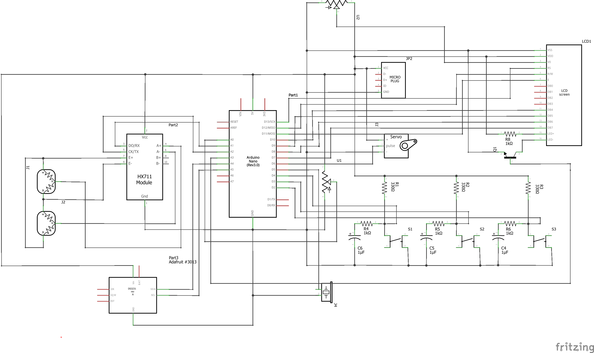

# Project Documentation for PPAP (Pood Por A Pet)

## By Francis John Magallanes, Jessica Dave Semira, and John Matthew Vong

This is a arduino code for a machine that will automate the dispensing of the pet food.
The machine will have a simple user interface that displays the clock time once the user plug it in. 
Users have an option to choose from the three presets available based on the size of the dog but they 
can also set their preferred frequency, amount, and time of feeding through the customizable option. 
Once the time of feeding and the frequency of feeding is already set, the machine will dispense food 
based on the preferred amount at the indicated time and frequency. The user can also see how many grams
left in the machine’s food storage to check if their stock is sufficient enough. Lastly, there are two 
buzzing sounds, first is to notify the dogs to approach the dispensed food and the second one is to notify
the user if they already need to refill the machine’s food storage. 

The schematic diagram of the project and has the following electronic components:
- Perf Board
- Arduino Nano
- HX711 Scale Module
- 50kg load cell
- MG996R Servo Motor
- Push Button 
- 10k Potentiometer
- DS3231 RTC Module
- Micro-usb breakout board
- 16x2 LCD display
- Piezo-electric buzzer
This project is powered by an android charger that delivers a 5V supply.
Thus, the micro plug will act as a 5V voltage supply.  

Circuit Schematic:

